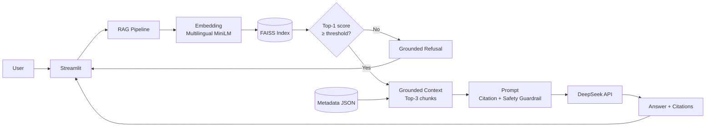
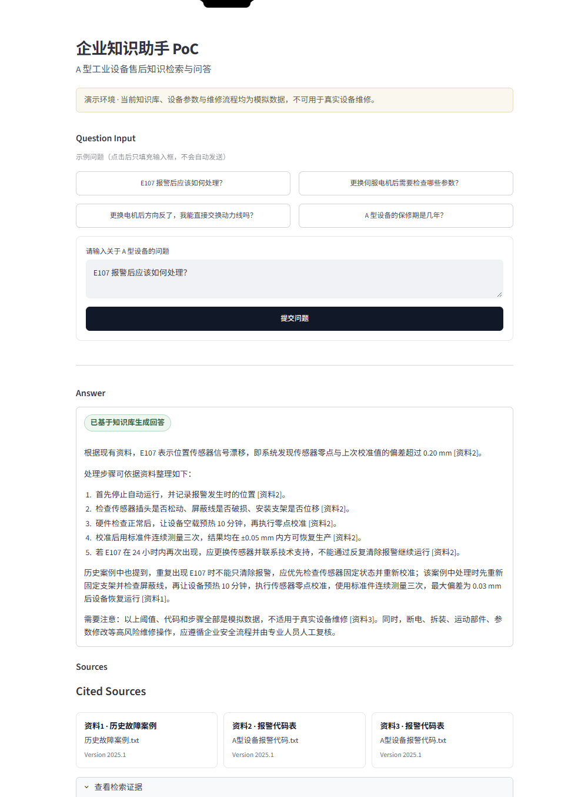
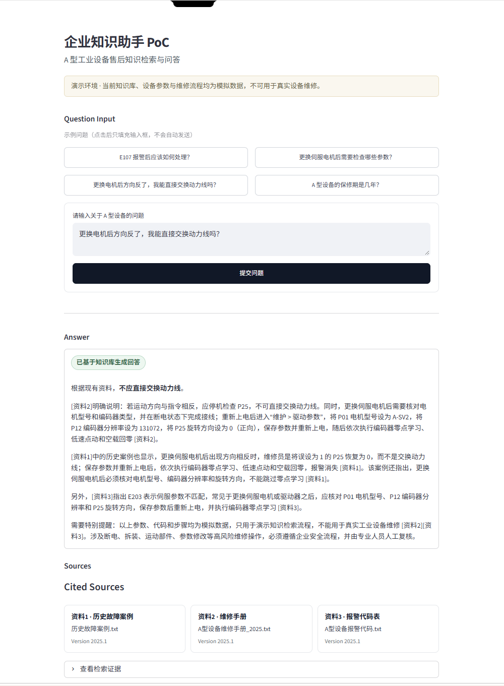
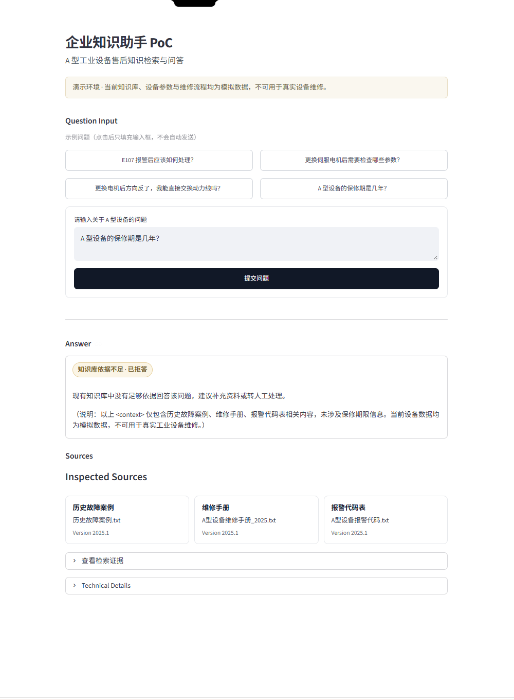
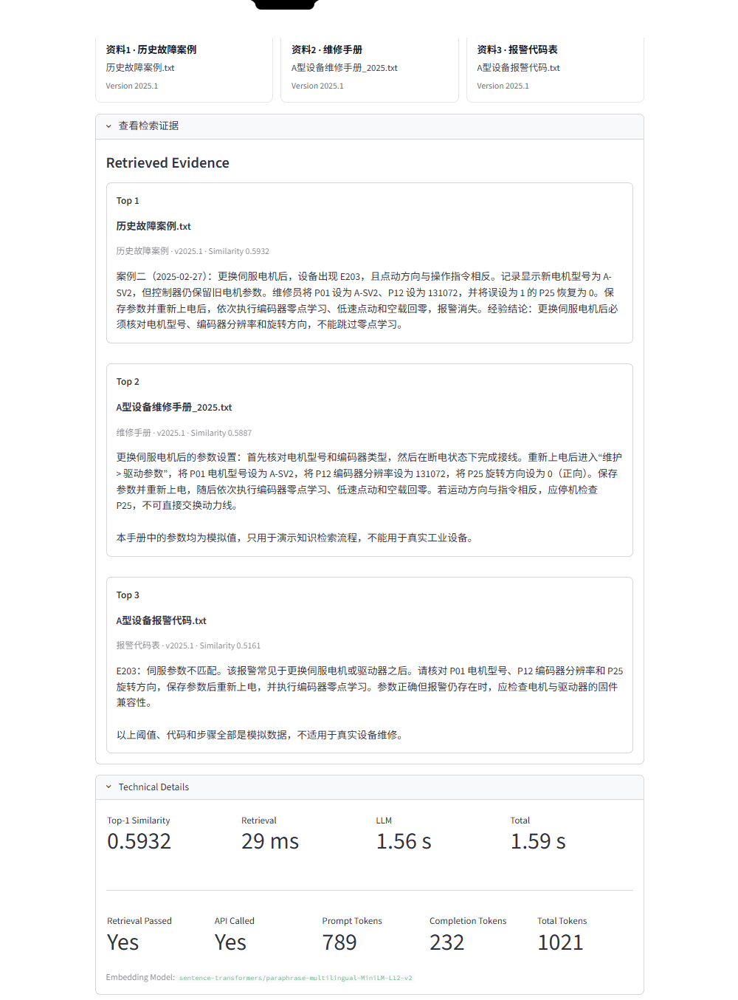

# Enterprise AI Knowledge Assistant

面向工业设备售后场景的企业知识助手 PoC，覆盖需求分析、RAG、Evaluation、ROI、PoC Design、Streamlit Demo、Docker 与 Huawei Cloud ECS 部署。

**项目定位：Personal Project / Simulated Enterprise AI PoC**

这是一个个人完成的企业 AI 解决方案案例，不对应任何真实客户。项目中的企业、设备、参数、报警、维修流程、知识文档和业务测算均为模拟数据，不可用于真实工业设备维护。

## 1. Business Problem

案例背景是一家模拟的华东工业自动化设备公司，约有 70 名售后工程师。维修手册、报警代码和历史故障案例分散在不同文档中，现场人员需要依赖关键词搜索、个人经验或资深工程师支持。

主要问题：

- 知识检索耗时，现场问题处理速度不稳定；
- 文档版本不一致，答案来源难以追溯；
- 新员工学习成本高；
- 高频问题反复升级到资深人员；
- 不同区域的处理方式不一致。

## 2. Solution Overview

本项目使用 Retrieval-Augmented Generation（RAG）构建售后知识助手：

```text
Question
  → Embedding
  → FAISS Retrieval
  → Grounded Context
  → DeepSeek
  → Answer + Citation / Refusal
```

系统先从本地模拟知识库检索相关片段，再将通过阈值判断的证据交给 DeepSeek 生成回答。回答要求附带来源引用；当知识库依据不足时，系统拒绝给出无依据结论。

## 3. Architecture



- Embedding、FAISS、metadata 与知识文件在本地运行；
- Top-K、threshold、citation 和 high-risk guardrail 构成可观察的回答边界；
- DeepSeek 是外部 LLM，只有通过 retrieval gate 的问题才会进入生成流程。

## 4. Demo

Demo 已在实际 Huawei Cloud ECS Docker 环境完成正常回答、高风险问答和 Grounded Refusal 验证。

以下截图来自该实际部署，已裁除浏览器 chrome、公网 IP、私人 tab 和账号信息。

### Normal grounded answer

系统基于知识库检索结果生成回答并展示引用来源。



### High-risk guardrail

对于涉及设备维修和参数修改的高风险问题，系统给出 grounded answer 并保留人工复核边界。



### Grounded refusal

当检索结果与问题语义相关、但 context 不包含所需事实时，系统拒绝生成无依据答案。



### Retrieval evidence & diagnostics

Demo 可展开查看 Top-3 retrieved chunks、Similarity、latency、token usage 和 API status。



## 5. Evaluation

Evaluation 使用固定的 **20-case simulated evaluation set**。以下结果来自冻结的 Phase 4 Run 3，而不是 production accuracy。

### Automated behavior

| Metric | Result |
|---|---:|
| Final Behavior Accuracy | 95% |
| False Refusal | 1 |
| False Answer | 0 |
| API Error | 0 |

### Full Manual Review

| Metric | Result |
|---|---:|
| Answer / Refusal Quality | 38/40 = 95% |
| Citation Quality | 27/30 = 90% |
| High-risk Guardrail Quality | 24/24 = 100% |

Failure analysis：

- threshold-induced false refusal：正确证据位于 Top-2，但 Top-1 低于阈值，系统在调用 LLM 前拒答；
- weak Top-1 ranking recovered by Top-3 + LLM：部分问题的首条结果较弱，但 Top-3 context 支持 grounded generation；
- minor citation-attribution issues：少量通用安全说明的 citation 归因不够精确；
- in-domain but unanswerable retrieval false positive：问题通过 retrieval，但 LLM 根据 context 正确拒答；
- generation variation：外部生成模型的措辞和证据组织可能随调用变化。

完整结果见 [`evaluation/phase4_evaluation_summary_run3.md`](evaluation/phase4_evaluation_summary_run3.md)。这些指标只描述该固定 20-case 模拟测试集，不能表述为“RAG accuracy”或生产准确率。

## 6. Business Case / ROI

### Workload assumptions

| Input | Simulated assumption |
|---|---:|
| 售后工程师 | 70 人 |
| 技术查询 | 3 次 / 人 / 天 |
| 工作日 | 220 天 / 年 |
| Baseline 查询时间 | 15 分钟 / 次 |
| 目标查询时间 | 5 分钟 / 次 |
| 人力价值假设 | 120 RMB / 小时 |

基于上述假设：

- Theoretical maximum：11,550 hours/year；
- 查询时间从 15 分钟降至 5 分钟：7,700 theoretical hours released；
- 理论人力价值：924k RMB/year。

### Scenario analysis

| Scenario | Assumed benefit | Illustrative ROI |
|---|---:|---:|
| Conservative | 277.2k RMB | -39.73% |
| Base | 591.36k RMB | 28.56% |
| Optimistic | 831.6k RMB | 80.78% |

`time released != cash saving`。以上成本与收益均为案例假设，ROI 必须通过真实 PoC 的采用率、节省时间、升级率和运营成本重新校准，不能解释为真实客户收益。

## 7. PoC Design

模拟 PoC 范围：

- 12 个 device models；
- 约 600 份 documents；
- 约 80 个 historical cases；
- 10 名试点工程师；
- 4 周验证周期；
- 约 100 个 historical questions。

建议验证指标包括 answer/refusal quality、retrieval time、adoption、escalation rate 和 high-risk guardrail。以上规模和计划均为 **simulated PoC design**，不是已经发生的客户项目。

## 8. Cloud Deployment

实际验证环境：

- Huawei Cloud ECS；
- Ubuntu 24.04；
- 2 vCPU / 4 GiB；
- Docker + Streamlit；
- Local FAISS；
- offline-mounted `sentence-transformers/paraphrase-multilingual-MiniLM-L12-v2`；
- external DeepSeek API。

```text
Browser
  → Huawei Cloud EIP
  → Security Group
  → ECS
  → Docker
  → Streamlit
  → RAG
  → DeepSeek API
```

实际完成的验证：

- Docker image successfully built；
- container health check passed；
- Streamlit publicly accessible；
- normal answer validated；
- high-risk answer validated；
- grounded refusal validated。

README 不记录真实公网 IP。UI Sidebar 的 `Environment` 来自 `DEPLOYMENT_ENV` 配置；它不是硬编码的云产品信息。本地默认显示 `Local PoC`，云端设置为 `Huawei Cloud ECS`。

更完整的设计边界见 [`docs/CLOUD_DEPLOYMENT_DESIGN.md`](docs/CLOUD_DEPLOYMENT_DESIGN.md)。

## 9. Data Boundary & Security

| Boundary | Data / processing |
|---|---|
| Local / ECS | source documents、embedding、FAISS index、metadata、retrieval |
| External LLM | user question、retrieved context、完整 prompt、LLM response |

**RAG != private deployment.** 即使知识文件和 FAISS 都位于企业内部，只要 retrieved chunks 被发送给 external LLM，这些内容就跨越了企业数据边界。HTTPS 保护传输过程，但不会让外部处理变成本地处理。

当前 PoC 不代表 production-ready。生产环境仍需根据风险和合规要求补充：

- authentication / RBAC；
- audit 与 secrets management；
- monitoring、backup 与 patch management；
- data classification / approval；
- HA、HTTPS 与 reverse proxy。

## 10. Deployment Lessons

### Docker Hub / SWR

部署过程中遇到 Docker 29 与 SWR mirror 的 referrers 兼容问题，最终通过调整 Docker daemon 配置解决。该问题属于镜像分发链路，而不是 RAG 逻辑故障。

### Hugging Face access

ECS 无法直接访问 Hugging Face，因此最终将本地 MiniLM cache 以只读 volume mount 提供给容器，并设置：

```text
HF_HUB_OFFLINE=1
TRANSFORMERS_OFFLINE=1
```

该处理没有更换 embedding model version，FAISS index 与 query embedding 继续使用同一模型。

## 11. Project Structure

```text
app.py                 Streamlit Demo
rag.py                 RAG orchestration and DeepSeek call
query.py               FAISS retrieval
ingest.py              Document ingestion and index build
data/                   Simulated source documents
vector_store/           FAISS index and metadata
evaluation/             Fixed test set, scripts and final results
docs/                   Cloud design and sanitized Demo assets
Dockerfile              Reproducible container runtime
.env.example            Environment variable template
README.md               Portfolio overview
```

## 12. Run Locally

```bash
python -m venv .venv
```

激活虚拟环境后：

```bash
pip install -r requirements.txt
```

复制 `.env.example` 为 `.env`，并填写自己的 DeepSeek API Key：

```dotenv
DEEPSEEK_API_KEY=your_api_key_here
DEEPSEEK_MODEL=deepseek-flash
DEPLOYMENT_ENV=Local PoC
```

启动：

```bash
streamlit run app.py
```

## 13. Run with Docker

### Basic

```bash
docker build -t enterprise-ai-knowledge-assistant .
docker run --env-file .env -p 8501:8501 enterprise-ai-knowledge-assistant
```

打开 [http://localhost:8501](http://localhost:8501)。`.env` 通过 runtime injection 提供，不进入镜像。在线环境首次启动时可能需要下载 embedding model。

### Offline model cache

以下 `/path/to/hf-cache` 是公开文档占位路径，不是实际 ECS 路径：

```bash
docker run -d \
  --name enterprise-ai-demo \
  --env-file .env \
  -e DEPLOYMENT_ENV="Huawei Cloud ECS" \
  -e STREAMLIT_SERVER_FILE_WATCHER_TYPE=none \
  -e HF_HOME=/root/.cache/huggingface \
  -e HF_HUB_CACHE=/root/.cache/huggingface/hub \
  -e HF_HUB_OFFLINE=1 \
  -e TRANSFORMERS_OFFLINE=1 \
  -v /path/to/hf-cache:/root/.cache/huggingface:ro \
  -p 8501:8501 \
  enterprise-ai-knowledge-assistant
```

离线缓存必须预先包含 metadata 中声明的相同 embedding model；不得用其他模型缓存替代，否则 index 与 query embedding 将不匹配。

## Project Status

**Completed Portfolio PoC**

This project is a simulated enterprise AI solution case. It is not a production industrial maintenance system.
