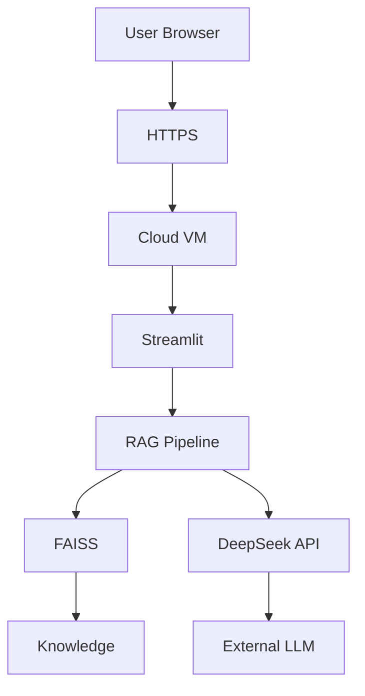
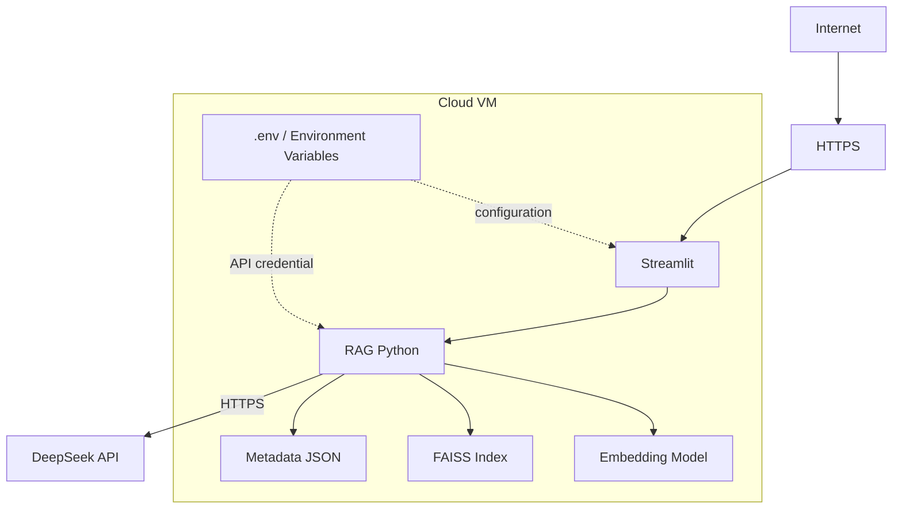

# Cloud Deployment Design

## 1. Purpose and scope

This document turns the current local proof of concept (PoC) into a minimal cloud deployment design that can be reviewed by engineering, IT, security, and compliance teams.

The design deliberately keeps the existing RAG behavior unchanged. It does not introduce Kubernetes, Redis, Kafka, RDS, Elasticsearch, a managed vector database, serverless components, a load balancer, a CDN, or microservices. No cloud resources are purchased or deployed as part of this phase.

The target architecture is:

```text
Browser
  -> Internet / HTTPS
  -> Cloud VM
  -> Streamlit Application
  -> RAG Pipeline
     -> Local Embedding Model
     -> Local FAISS Index + Local Metadata
     -> External DeepSeek API
  -> Answer
```

This is a single-VM design intended for a small demonstration or PoC, not a claim of production readiness.

## 2. Current system and cloud target

The local system currently follows this path:

```text
User
  -> Streamlit app.py
  -> rag.py
  -> sentence-transformers embedding
  -> FAISS local index
  -> chunks_metadata.json
  -> DeepSeek API
  -> answer
```

For the minimum cloud deployment, the same application code and data flow move onto one VM. Streamlit, the Python runtime, the embedding model, FAISS, metadata, and optionally the source documents remain together on that VM. Only the browser traffic and the DeepSeek API call cross the VM boundary.

## 3. Minimum cloud resources

### 3.1 Cloud VM / ECS / CVM

A cloud VM is the server that runs the PoC. Different providers use names such as ECS or CVM, but the role is the same here. One VM hosts:

- Streamlit;
- the Python runtime and project dependencies;
- the RAG Python code;
- the sentence-transformers embedding model;
- the FAISS index;
- `chunks_metadata.json`;
- optionally the source knowledge documents and application logs.

The single VM is the main unit to operate, secure, back up, and monitor.

### 3.2 System disk

The system disk stores the operating system, Python, installed dependencies, application code, and basic system files. It can also hold all PoC data initially, although separating changeable data onto a data disk makes backup and replacement of the VM easier.

### 3.3 Optional data disk

An additional data disk is optional for the current small PoC. If used, it should hold data that needs an independent backup or lifecycle:

- source knowledge documents;
- `vector_store/faiss.index`;
- `vector_store/chunks_metadata.json`;
- application logs.

Attaching the disk as a stable filesystem location avoids mixing application data with the operating system. It does not by itself provide backup or high availability.

### 3.4 Public IP

The public IP gives the browser a network address for reaching the application and lets the VM initiate outbound HTTPS calls to the DeepSeek API. For a formal demo, users should access a domain name over HTTPS rather than use the raw IP directly.

### 3.5 Security group / firewall

The security group is the cloud-side network allowlist for the VM. It should allow only required traffic:

- inbound HTTPS (`443`) from the intended audience;
- inbound SSH (`22`) only from approved administrator IP ranges, if SSH administration is required;
- outbound HTTPS (`443`) so the VM can call DeepSeek and obtain approved software or model updates.

Streamlit commonly listens on port `8501`. For a formal setup, that port should not be open directly to the whole Internet; an HTTPS endpoint on the VM can forward traffic internally to Streamlit. A short-lived internal demo may expose `8501` only to a tightly restricted source range.

### 3.6 Domain and HTTPS

A domain and HTTPS certificate are optional for an early technical test, but expected for a formal demonstration. HTTPS encrypts browser-to-VM traffic and gives users a stable, recognizable address. Certificate renewal must be operationally owned if the deployment continues beyond a temporary demo.

### 3.7 No standalone database

The current PoC does **not** need a standalone database. FAISS stores the vector index locally and the JSON file stores chunk metadata. Adding a database now would create operational work without changing the PoC's essential behavior.

## 4. Project-specific terminology

| Term | Meaning in this project |
|---|---|
| VM / ECS | The cloud server that replaces the developer machine as the always-on host for Streamlit, Python, the embedding model, FAISS, metadata, and related files. ECS/CVM are provider-specific names for a VM service. |
| Public IP | The Internet-routable address used to reach the demo and to associate a domain with it. It also identifies the VM's Internet-facing network presence; outbound routing details vary by cloud provider. |
| Private IP | The VM's address inside the cloud network. Streamlit or a local HTTPS proxy can communicate through private/local interfaces without exposing internal ports publicly. |
| VPC | The isolated cloud network containing the VM. For this PoC it provides a controlled network boundary, even though there is only one application server. |
| Security Group | Rules attached to the VM that allow or reject network traffic. For this design, the important rule is to permit only HTTPS for users and tightly restricted SSH for administrators. |
| Inbound | Traffic arriving at the VM, such as a user's HTTPS request or an administrator's SSH connection. |
| Outbound | Traffic initiated by the VM, especially HTTPS requests to the DeepSeek API and controlled dependency/model downloads. |
| HTTPS | Encrypted HTTP used for browser access and the DeepSeek API call. It protects data in transit, but does not change which party receives the data. |
| Port | A numbered network entry point. The browser normally uses `443` for HTTPS; SSH uses `22`; Streamlit defaults to `8501`, which should normally stay behind the public HTTPS endpoint. |
| Docker | An optional way to package the application and its dependencies consistently. It is not required by this single-VM design, and this phase does not create a Docker image or Dockerfile. |
| Volume | Persistent storage mounted into the VM or a container. In this design, a data disk can act as the volume for documents, the FAISS index, metadata, and logs. |
| Environment Variable | A runtime setting kept outside source code. `DEEPSEEK_API_KEY` and environment-specific configuration should be supplied this way, commonly loaded from a protected `.env` file for this PoC. |

## 5. Data flow



Request flow:

1. The browser sends a question to Streamlit over HTTPS.
2. The RAG pipeline embeds the question and searches the local FAISS index and metadata.
3. The pipeline selects relevant chunks and builds a prompt containing the question and retrieved context.
4. That prompt is sent over HTTPS to the external DeepSeek API.
5. DeepSeek returns a generated answer, which Streamlit displays to the user.

FAISS, metadata, and source documents can remain on the VM. However, as soon as a retrieved chunk is included in the prompt sent to DeepSeek, that content leaves the VM and potentially the enterprise boundary. HTTPS protects the transfer in transit; it does not make the external API local or private.

## 6. Data Boundary

The meaningful boundary is not simply "where the vector database is." It is where readable business content is processed.

### A. Local processing

The following activities can remain on the VM or inside the enterprise environment:

- storing source documents;
- document chunking during ingestion;
- generating embeddings with sentence-transformers;
- building and searching the FAISS index;
- searching and reading chunk metadata.

Embeddings and indexes should still be treated as protected business data because they are derived from source content, even though they are not normally sent to DeepSeek in this design.

### B. External processing

The following data is processed by the external DeepSeek service for each answer:

- the user's question;
- the retrieved context/chunks selected by FAISS;
- the complete prompt and its instructions;
- the DeepSeek API response.

Therefore, RAG does not automatically mean private deployment. Hosting the documents and vector index inside the company reduces the local data footprint exposed to external services, but every retrieved passage sent to an external LLM still crosses the data boundary. Before using real enterprise data, the organization must review data classification, provider terms, retention, regional processing, access controls, and any required redaction or approval.

## 7. Deployment options

| Option | Topology | Advantages | Trade-offs / risks | Fit |
|---|---|---|---|---|
| A. Public Cloud VM + External DeepSeek API | Internet-facing cloud VM hosts the whole PoC; retrieved context is sent to DeepSeek. | Low infrastructure cost; quick to deploy; simple to demonstrate and troubleshoot. | Retrieved context goes to an external model provider; Internet exposure and data compliance must be reviewed. | Strong fit for a PoC using non-sensitive or approved data. |
| B. Private / Enterprise VM + External LLM API | Application, documents, and FAISS run in an enterprise-controlled network; the VM calls an external LLM API. | Source documents and the vector index remain in the enterprise environment; IT has stronger network, identity, patching, and backup control. | The selected retrieved context and user question still leave the enterprise boundary; outbound connectivity and provider compliance remain required. | Useful when local assets require tighter control but an approved external model is acceptable. |
| C. Private Deployment + Private / Self-hosted LLM | Application, retrieval, and LLM inference all run within an approved private environment. | Data can remain within the controlled environment; highest control over model access, logging, and retention. | Requires substantial GPU capacity, model serving, security, monitoring, upgrades, and specialist operations; significantly increases PoC cost and complexity. | Appropriate when data policy prohibits external LLM processing or later scale justifies the operational investment. |

No option is universally best. The decision depends on data classification, compliance obligations, expected users, time-to-demo, budget, and the operations capability available to support it.

## 8. Minimum security controls

### 8.1 Required for a cloud-hosted PoC

- Never place the DeepSeek API key in Python source code.
- Supply secrets through a protected `.env` file or environment variables; restrict file permissions and access to the VM.
- Keep `.env` out of Git. The current `.gitignore` includes `.env`, but repository history and any copied archives should also be checked before a real deployment.
- Use a security group with the minimum required inbound and outbound rules.
- Use HTTPS for browser access and for the DeepSeek API connection.
- Use SSH key-based administrator login; disable or avoid weak password authentication.
- Apply least privilege to cloud accounts, VM users, service processes, files, and API credentials.
- Do not expose knowledge files, the FAISS index, or metadata through a public static directory.
- Do not record API keys in application, shell, proxy, or deployment logs.
- If real sensitive data is introduced, do not log full prompts, retrieved chunks, questions, or responses by default.
- Regularly update the OS and Python dependencies using a controlled, tested process.
- Back up source documents, the FAISS index, and metadata, and test restoration. If the index is reproducible from approved source documents, document that recovery path as well.
- Separate test and production environments, credentials, data, and access policies.

### 8.2 Current PoC versus production requirement

| Area | Current PoC position | Production requirement |
|---|---|---|
| Architecture | Single local application with local FAISS and JSON metadata. | Supported hosting design with defined owners, availability targets, capacity limits, and recovery procedures. |
| Secrets | Local `.env` pattern; `.env` is listed in `.gitignore`. This is useful but not a complete secret-management program. | Managed secret lifecycle, restricted access, rotation, revocation, auditability, and incident response. |
| Network | Local development access; no documented production ingress boundary. | HTTPS, minimal security-group rules, controlled administration, approved outbound destinations, and periodic rule review. |
| Identity | PoC UI should not be assumed to provide enterprise authentication or authorization. | User authentication, authorization/RBAC, session controls, joiner/mover/leaver process, and access audit where required. |
| Data governance | Suitable only for test or explicitly approved data until external processing is reviewed. | Data classification, LLM-provider approval, retention/deletion rules, regional/compliance review, and controls for sensitive prompts and context. |
| Logging and monitoring | Development-level behavior; no claim of centralized audit, alerting, or sensitive-data filtering. | Operational metrics, safe logs, alerting, audit trail, redaction policy, and defined support response. |
| Reliability | A VM, local files, and a single application process create single points of failure. | Tested backup/restore, patching and rollback, health checks, incident procedures, and availability design appropriate to the business need. |
| Dependency assurance | Dependencies are declared for the PoC; production hardening is not established by this design. | Version control/pinning policy, vulnerability scanning, tested upgrades, provenance controls, and repeatable builds. |

The largest gap is not raw compute capacity. It is the set of operational and governance controls around identity, data approval, secrets, monitoring, recovery, patching, and service ownership. This document defines a deployable shape, but it does not certify the current demo as enterprise-secure or production-ready.

## 9. Deployment topology



Operationally, all boxes inside `Cloud VM` share one failure and maintenance domain. The diagram describes component placement, not process isolation or high availability.

## 10. Resource sizing approach

Sizing should be based on the knowledge-base size, embedding model, expected concurrency, and measured query latency rather than a fixed cloud-provider instance name.

### CPU

Streamlit and FAISS retrieval for a small index are relatively light. CPU is also used for query embedding and any ingestion work. Start with general-purpose CPU capacity, then measure query latency and concurrent-user behavior. Ingestion can be performed as a controlled administrative task rather than at peak usage time.

### RAM

Memory must cover:

- the Python runtime and Streamlit process;
- the sentence-transformers model;
- the FAISS index while loaded or memory-mapped, depending on implementation;
- metadata and temporary prompt data;
- headroom for concurrent users and operating-system services.

The index size and peak concurrent queries are the two project-specific values most likely to change the initial estimate. Memory exhaustion is more disruptive than moderate CPU saturation, so leave measurable headroom.

### Disk

Disk capacity must include:

- the operating system and updates;
- Python packages and virtual environments;
- the embedding model cache;
- source documents;
- the FAISS index and metadata;
- controlled logs and backup staging space.

Track growth of the documents, index, model cache, and logs separately. A data disk is helpful when those assets need a different backup or retention policy from the system disk.

### Bandwidth

Normal Streamlit UI traffic is small, as are typical DeepSeek API requests and responses relative to model downloads. The first embedding-model download and dependency installation can be much larger. Retrieved chunks increase outbound prompt size, so prompt limits and sensitive-data controls matter even if network volume remains modest.

### GPU

The current small PoC does not require a GPU. Sentence-transformers embeddings can run on CPU, and LLM inference is provided by the external DeepSeek API. GPU requirements become significant only if the organization chooses to self-host the LLM, or later proves that embedding throughput cannot meet a defined workload on CPU.

## 11. Operations and recovery notes

- Treat the VM as replaceable: document how to restore code, dependencies, configuration, documents, index, and metadata onto a fresh VM.
- Back up the source documents and the matching FAISS index/metadata as a consistent set, or rebuild and validate the index from the approved sources.
- Keep environment-specific secrets out of backups unless the backup is encrypted and access-controlled under an approved process.
- Define who owns OS patching, application updates, certificate renewal, API-key rotation, backup checks, and incident response before a formal demo.
- Test changes in a separate test environment before applying them to production data or the production VM.

## 12. Future expansion

Expansion should be driven by measured demand or control requirements:

```text
PoC
  Single VM + local FAISS

Small production
  Web app
    -> API service
    -> vector database / object storage
    -> authentication / RBAC
    -> centralized logs

Larger deployment
  load balancing
    -> multiple application instances
    -> managed vector database
    -> private LLM or governed LLM gateway
```

These are future directions only. They are intentionally not part of the Phase 6A implementation scope.

## 13. Phase 6A decisions and exclusions

- Keep the RAG pipeline and Streamlit behavior unchanged.
- Use one VM and local FAISS/metadata for the minimum cloud design.
- Continue using the external DeepSeek API, subject to data-boundary and compliance approval.
- Do not deploy resources, rebuild the index, run evaluation, or create container artifacts in this phase.
- Revisit production architecture only after requirements for users, availability, data classification, authentication, and recovery are defined.
